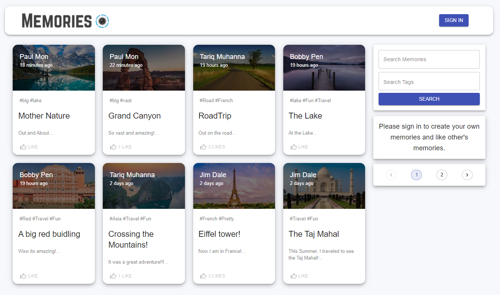
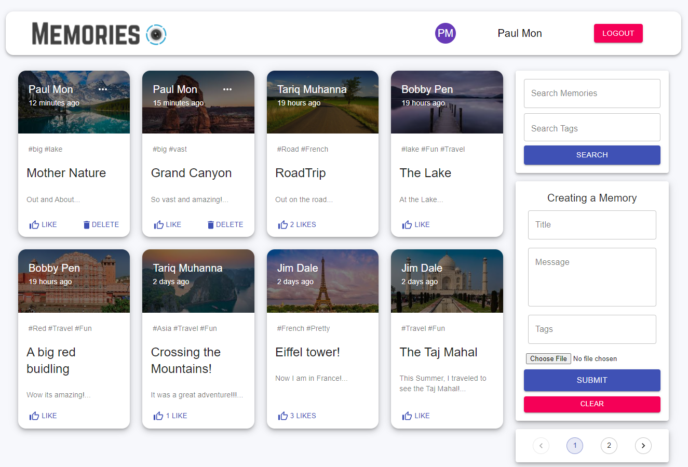
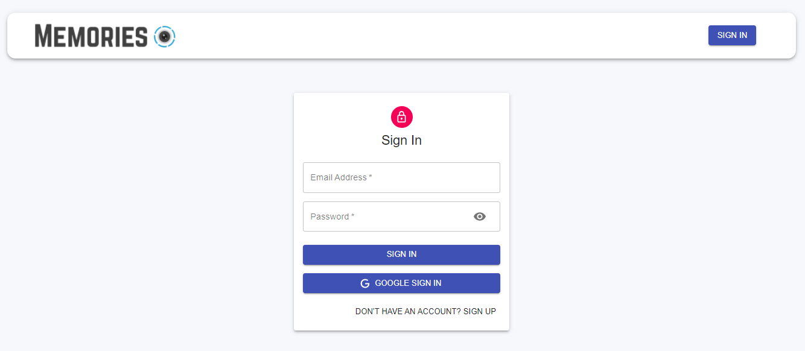
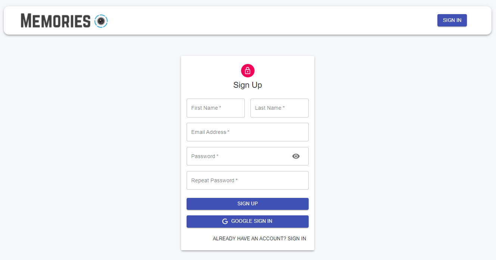
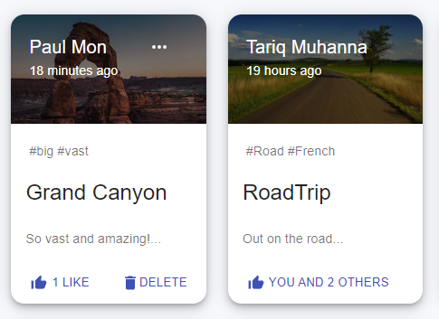
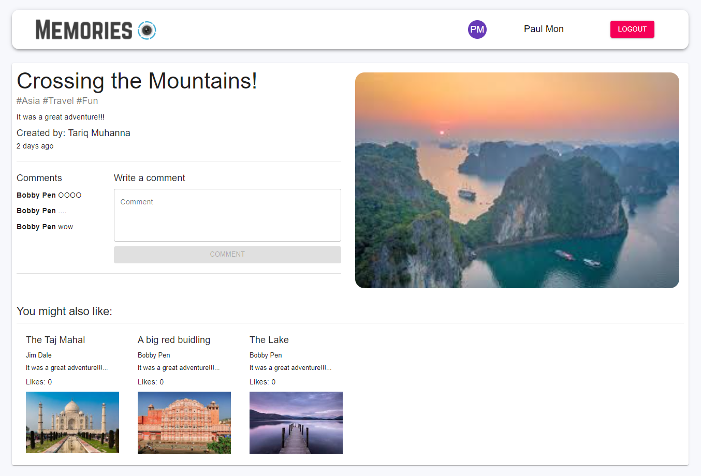

# Full-Stack MERN Memories Social Media App

<!-- TABLE OF CONTENTS -->

  
Table of Contents

  <ol>
    <li>
      <a href="##Description">Description</a>
    </li>
    <li>
      <a href="#getting-started">Getting Started</a>
      <ul>
        <li><a href="#prerequisites">Prerequisites</a></li>
        <li><a href="#installation">Installation</a></li>
      </ul>
    </li>
    <li><a href="#usage">Usage</a></li>
    <li><a href="#roadmap">Roadmap</a></li>
    <li><a href="#contributing">Contributing</a></li>
    <li><a href="#license">License</a></li>
    <li><a href="#contact">Contact</a></li>
    <li><a href="#acknowledgments">Acknowledgments</a></li>
  </ol>

## Description 

Memories is a fully responsive full-stack social media application that is built on the MERN stack. The MERN stack includes:
- MongoDB - Document database
- Express.js - Node.js web framework
- React.js - Client-side JavaScript framework
- Node.js - JavaScript web server

The supports both email and Google Authentication, pagination, search and filtering capabilities, comments, and recommending similar posts to the user.

## Hompage
When initially starting or opening the application, the user will be presented with the homepage:

From here, the user has access to alot of options, such as:
- Searching the posts by title or tags
- Moving between pages of post generated by pagination
- Clicking on specific posts for more details (See Post Details section)
- Signing into the account (See Authentication section)

Once signed in, the user will have options to interact with the applicaiton like:
- Creating posts
- Liking posts (See Posts section)
- Editing and Deleting posts that the user has created (See Posts section)
- Writing comments on sepcific posts (See Post Details section)

post details signed in pic
search and great pic

## Authentication

Once the user clicks on the "SIGN IN" button the top right, there will be a from fill up to sign into an account:

The user can login in using either their email and password or with Google Sign In. Or if the user does not have an account already, they can click the sign up option on the bottom right corner of the form and will be presented with a sign up form.

Once logged in the, the user will be redirected back to the homepage with their name and profile avator on the navigation bar.

## Post Details

Now back on the home page, initially if the user is not signed in, they cannot create, like, edit, comment, or delete the posts. When they are signed in, the user will then be able to create posts, like and comment on all posts, and only edit and delete their own posts.

## Post Details

The user can click on specific posts to be directed to a post details page where the can get more information from the post, add comments, and see recommended posts.

## Credits

Lastly I wanted to provide thanks to JavaScript Mastery for the wonderful project guide. I have provided a link to his website below:
https://www.completepathtojavascriptmastery.com/
